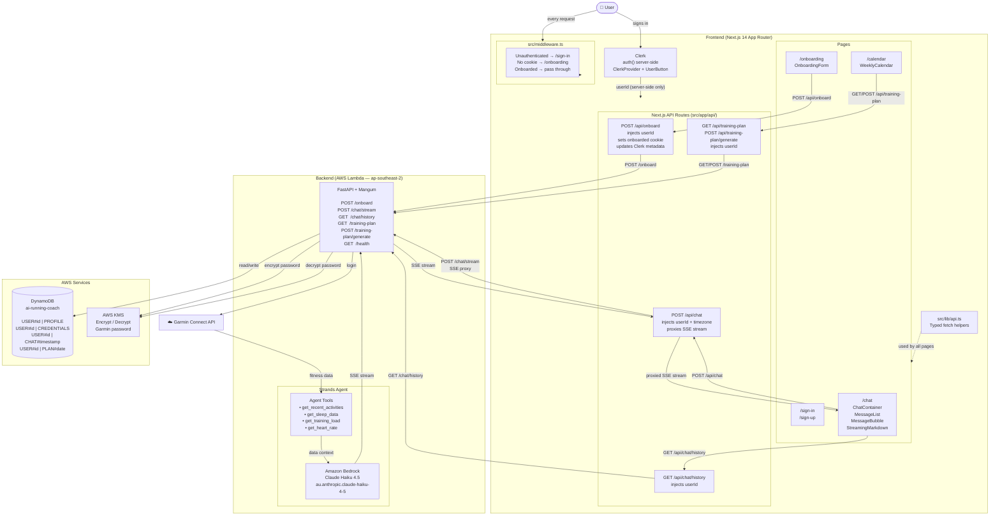

# System Architecture

## Request Flows

### Auth & Routing
1. Every request hits `src/middleware.ts`
2. Unauthenticated → redirected to `/sign-in`
3. Authenticated but no `onboarded` cookie → redirected to `/onboarding`
4. Fully onboarded → passes through to `/chat` or `/calendar`
5. `userId` is **never exposed to the client** — always injected server-side via `auth()` in API route handlers

### Onboarding
1. User fills in Garmin credentials + race goal on `/onboarding`
2. Client posts to `POST /api/onboard` (Next.js route handler)
3. Route handler injects `userId` via `auth()`, proxies to backend `POST /onboard`
4. Backend encrypts Garmin password with **KMS**, saves profile + credentials to **DynamoDB**
5. Route handler sets `onboarded=true` httpOnly cookie + updates Clerk `unsafeMetadata`

### Chat (Streaming)
1. User sends message in `ChatContainer`
2. Client posts to `POST /api/chat` with message + timezone
3. Next.js route handler injects `userId`, proxies to backend `POST /chat/stream`
4. Backend decrypts Garmin credentials via **KMS**, authenticates with **Garmin Connect**
5. **Strands Agent** fetches activities, sleep, HR, training load via Garmin tools
6. **Claude Haiku 4.5** generates response — streamed back via **SSE**
7. Next.js proxies the SSE stream directly to the client (`new Response(body)`)
8. `ChatContainer` reads the stream with `ReadableStreamDefaultReader`, appending tokens to the last assistant message in state
9. `StreamingMarkdown` renders plain text while streaming, switches to `react-markdown + remark-gfm` when done
10. Full conversation saved to DynamoDB after stream completes

### Training Plan
1. `WeeklyCalendar` fetches existing plan on mount via `GET /api/training-plan`
2. User hits "Generate" → `POST /api/training-plan/generate`
3. Backend fetches profile + Garmin data, agent generates **7-day JSON plan**
4. One DynamoDB item saved per day (`PLAN#YYYY-MM-DD`)
5. Frontend receives the generated week and renders it in the 7-column calendar grid
