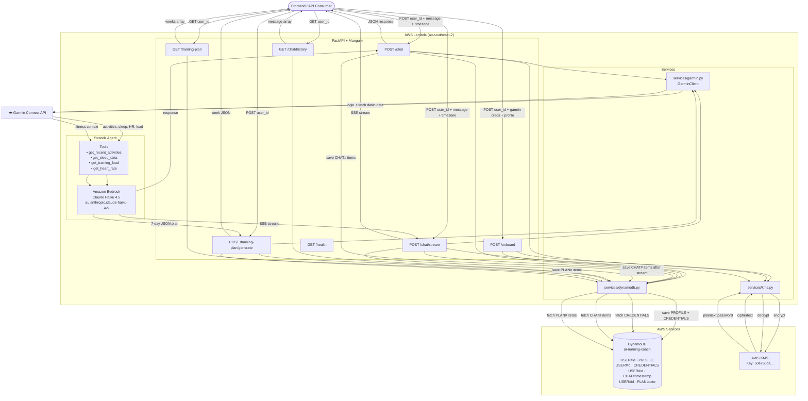

# Backend Architecture

## DynamoDB Single-Table Design

| PK | SK | Description |
|---|---|---|
| `USER#<userId>` | `PROFILE` | Goal race, target time, training days |
| `USER#<userId>` | `CREDENTIALS` | Garmin email + KMS-encrypted password |
| `USER#<userId>` | `CHAT#<timestamp>` | Individual chat messages |
| `USER#<userId>` | `PLAN#<YYYY-MM-DD>` | Individual training plan days |
