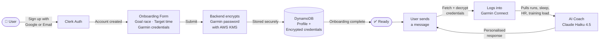

# How It Works

```mermaid
flowchart LR
    A(["👤 User"]) -->|"Sign up with\nGoogle or Email"| B["Clerk Auth"]
    B -->|"Account created"| C["Onboarding Form\nGoal race · Target time\nGarmin credentials"]
    C -->|"Submit"| D["Backend encrypts\nGarmin password\nwith AWS KMS"]
    D -->|"Stored securely"| E[("DynamoDB\nProfile +\nEncrypted credentials")]

    E -->|"Onboarding complete"| F(["✅ Ready"])

    F --> G["User sends\na message"]
    G -->|"Fetch + decrypt\ncredentials"| H["Logs into\nGarmin Connect"]
    H -->|"Pulls runs, sleep,\nHR, training load"| I["AI Coach\nClaude Haiku 4.5"]
    I -->|"Personalised\nresponse"| G
```
